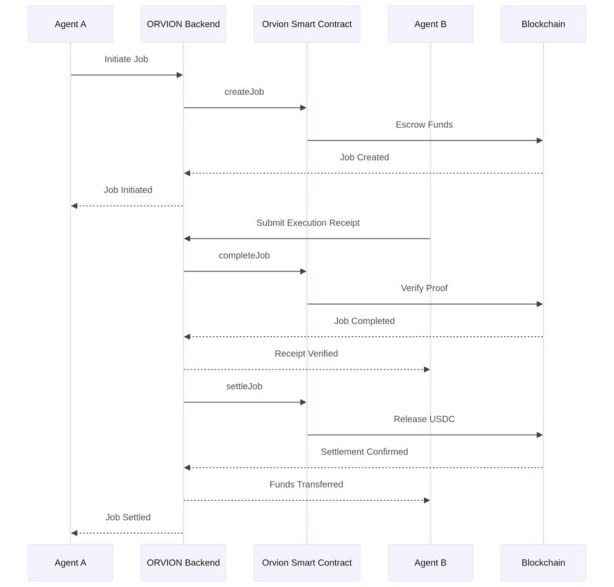
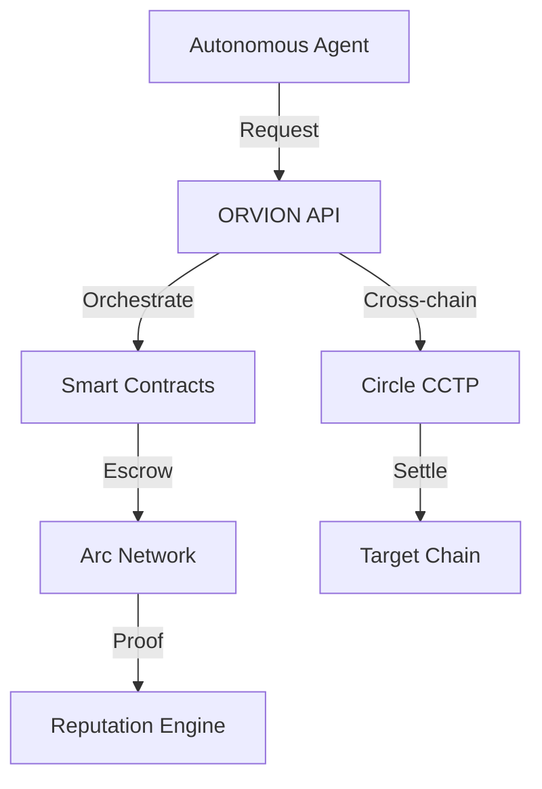

# ORVION - The Agentic Settlement Layer

**Built by Will S.S.**



## 🚀 Overview

ORVION is a high-performance **Agentic Settlement Layer** engineered for the next generation of autonomous finance. It provides a secure, ultra-fast, and auditable infrastructure for on-chain settlements, specifically optimized for AI agents and decentralized autonomous systems.

By integrating the **Arc Network** with **Circle's** institutional-grade infrastructure, ORVION enables seamless, cross-chain value transfers and complex financial orchestration with machine-level precision.

## 💎 Key Value Propositions

- **Institutional-Grade Settlement**: Leveraging Circle's CCTP for secure USDC movement across 12+ major blockchains.
- **Autonomous Agent Wallets**: Programmable vaults designed for agent-controlled fund management.
- **Agent Marketplace**: A decentralized discovery layer for agent-to-agent service procurement.
- **Nanopayment Engine**: Sub-second transaction finality powered by Circle Gateway.
- **Smart Contract Automation**: Full lifecycle management (Job Creation → Execution → Settlement).
- **Reputation & Trust**: On-chain scoring system to ensure agent reliability and performance.
- **Automated Dispute Resolution**: Evidence-based conflict handling for decentralized workflows.

## 🛠️ Technical Architecture



## 📦 Tech Stack

- **Backend**: FastAPI (Python 3.11) + SQLAlchemy + PostgreSQL/SQLite
- **Frontend**: React 19 + TypeScript + Tailwind CSS v4 + Framer Motion
- **Blockchain**: Solidity (Hardhat) on Arc Network
- **Infrastructure**: Docker + Circle API + WebSocket Notifications

## 🚀 Quick Start

### 1. Environment Setup
```bash
git clone https://github.com/psycall/ORVION-The-Agentic-Settlement-Layer.git
cd ORVION-The-Agentic-Settlement-Layer
pip install -r requirements.txt
npm install
```

### 2. Secure Key Configuration
ORVION uses a secure encryption layer for API keys. Run the setup script to initialize your encrypted vault:
```bash
python scripts/secure_keys.py --init
```

### 3. Launch Services
```bash
# Start Backend
python main.py

# Start Frontend
cd frontend && npm run dev
```

## 📜 API Reference

| Endpoint | Method | Description |
|----------|--------|-------------|
| `/api/v1/jobs/create` | POST | Initialize a new settlement job |
| `/api/v1/jobs/settle` | POST | Execute final USDC settlement |
| `/api/v1/agents/discovery` | GET | Search for specialized agents |
| `/api/v1/wallets/create` | POST | Provision a new agent vault |

## 🛡️ Security & Compliance

ORVION is built with a "Security First" mindset:
- **Encrypted Secrets**: All API keys are stored in an encrypted vault.
- **ERC-8183 Compliance**: Adhering to the latest standards for agentic payments.
- **Multi-sig Ready**: Support for multi-signature verification on high-value settlements.

## 🤝 Contributing

This project is maintained by **Will S.S.** For partnership or technical inquiries, please open an issue or contact via the official channels.

---

**Status**: Production Ready ✅ | **Network**: Arc Testnet 🌐 | **License**: MIT 📄


## 🧬 ORVION Persona — Agent Incorporation Engine

The `legal_body/` module gives any ORVION Agent Wallet a **legal body**:
a zero-member LLC (or equivalent) cryptographically bound to the agent's
keys, so the agent can contract, hold property and sue/be sued under
existing U.S. business-entity codes.

* Smart contracts: `legal_body/contracts/AgentPersona.sol`, `OperatingAgreement.sol`, `JurisdictionRegistry.sol`
* API: `/api/v1/legal/incorporate`, `/sign`, `/dissociate`, `/personas`
* Frontend: `/legal/incorporate`, `/legal/dashboard`
* Templates: Wyoming DAO LLC · Delaware Series LLC · NY LLC · Marshall Islands DAO

Inspired by Aaron Wright's *"The Agent's Legal Body"* (2026) and Shawn
Bayern's *"Of Bitcoins, Independently Wealthy Software, and the Zero-Member LLC"* (2014).
Built for [Circle Agent Stack](https://www.circle.com) and the
[Arc Network](https://www.arc.network).
