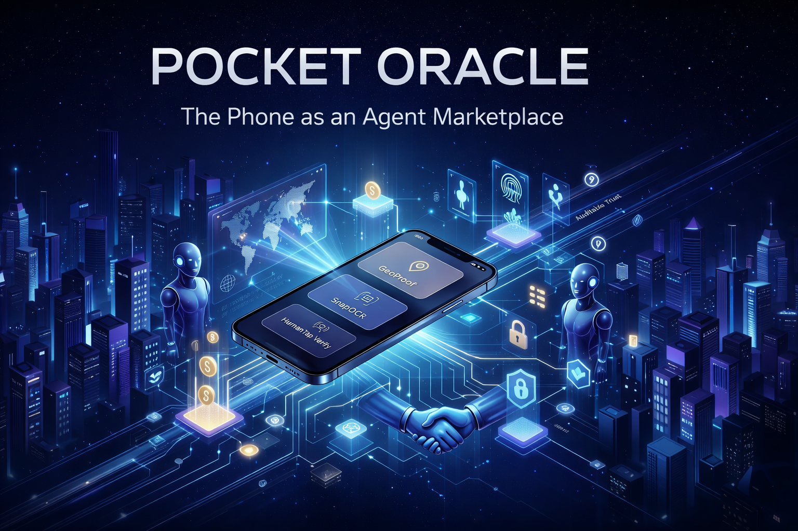
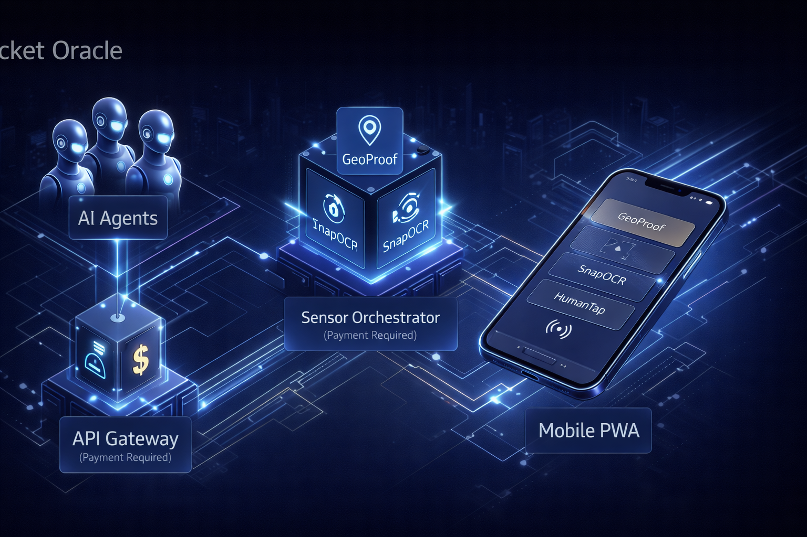
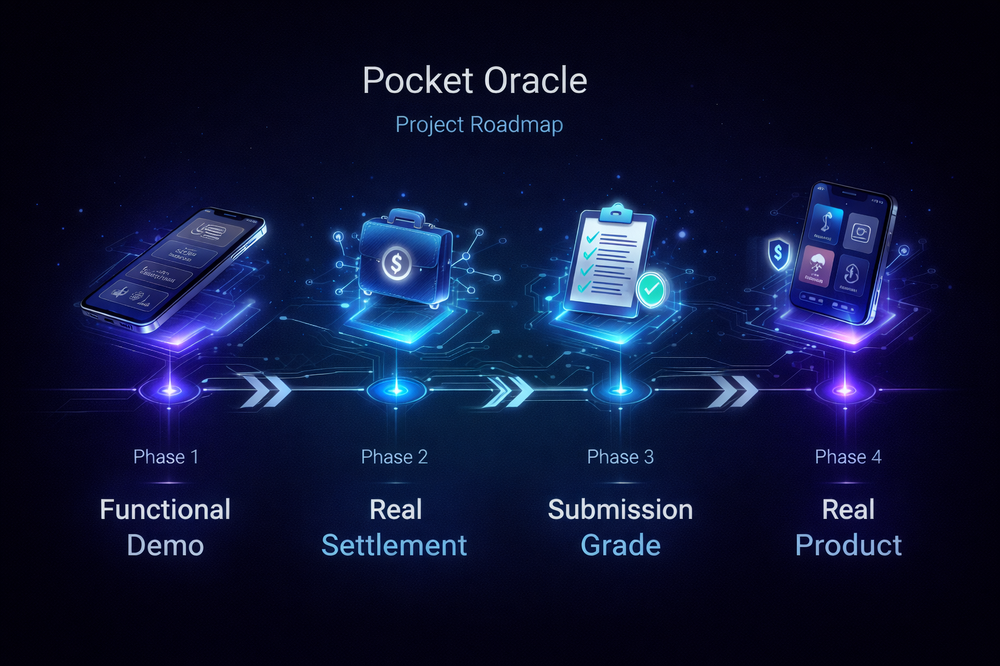

<p align="center">
  
</p>

<h1 align="center">Pocket Oracle</h1>

<p align="center">
  <strong>The Phone as an Agent Marketplace</strong><br>
  <em>Transformando smartphones em oráculos monetizáveis do mundo real para agentes de IA.</em>
</p>

<p align="center">
  <a href="https://github.com/psycall/Pocket-Oracle-The-Phone-as-an-Agent-Marketplace/actions"></a>
  <a href="https://github.com/psycall/Pocket-Oracle-The-Phone-as-an-Agent-Marketplace/blob/main/LICENSE"></a>
  <a href="https://github.com/psycall/Pocket-Oracle-The-Phone-as-an-Agent-Marketplace/stargazers"></a>
  <a href="https://github.com/psycall/Pocket-Oracle-The-Phone-as-an-Agent-Marketplace/network/members"></a>
  <a href="https://github.com/psycall/Pocket-Oracle-The-Phone-as-an-Agent-Marketplace/issues"></a>
</p>

<p align="center">
  <a href="#-visão-executiva">Visão Executiva</a> •
  <a href="#-arquitetura">Arquitetura</a> •
  <a href="#-funcionalidades-atuais">Funcionalidades</a> •
  <a href="#-roadmap">Roadmap</a> •
  <a href="#-segurança">Segurança</a> •
  <a href="README.en.md">English Version</a>
</p>



---

## 👁️ Visão Executiva

O **Pocket Oracle** resolve o gargalo de confiança entre o mundo digital e o físico. Quando um agente de IA precisa de uma confirmação do mundo real, ele não deve depender de processos manuais lentos. Ele deve ser capaz de **pagar centavos, receber uma resposta verificável e continuar sua execução em tempo real**.

Nossa tese é transformar cada smartphone em um nó de uma rede de oráculos descentralizada, onde a verificação humana e os sinais contextuais são ativos monetizáveis. Não somos apenas um aplicativo; somos uma infraestrutura de execução para a economia baseada em agentes.

---

## 🏗️ Arquitetura

O projeto é estruturado como um monorepo de nível industrial, garantindo escalabilidade, segurança e separação clara de responsabilidades.



| Camada | Papel Estratégico |
| :--- | :--- |
| **Gateway Pago** | Implanta o fluxo comercial e o comportamento `402 Payment Required`, atuando como a principal barreira de monetização. |
| **Operação Mobile** | PWA (Progressive Web App) que transforma o smartphone no centro de coleta de dados e interação humana. |
| **Sensor Orchestrator** | Inteligência em FastAPI responsável por processar OCR, validar GeoProof e gerenciar a confirmação humana. |
| **Admin Dashboard** | Visão executiva de métricas, estado da demonstração e governança do sistema. |
| **Infraestrutura** | Ambiente Dockerizado (PostgreSQL, Redis) para evolução previsível, segura e escalável. |

---

## 🚀 Funcionalidades Atuais

A versão atual entrega o esqueleto funcional para uma demonstração de alto impacto com uma narrativa econômica forte.

| Serviço | Descrição | Preço Sugerido (USDC) |
| :--- | :--- | :--- |
| **GeoProof** | Evidência contextual de localização verificável. | `0.0015` |
| **SnapOCR** | Extração de texto de ambientes físicos via câmera. | `0.0040` |
| **HumanTap** | Confirmação humana rápida, auditável e segura. | `0.0060` |

---

## 🗺️ Roadmap Estratégico

Estamos construindo mais do que um protótipo; estamos definindo um novo mercado de microserviços físicos para agentes.



### Fase 1: Demo Funcional (Atual)
- [x] PWA Mobile operacional.
- [x] Gateway com suporte a `402 Payment Required`.
- [x] Orquestrador de sensores básico.

### Fase 2: Liquidação Real
- [ ] Integração com wallets e micropagamentos.
- [ ] Provas auditáveis on-chain.
- [ ] Sistema de reputação inicial.

### Fase 3: Submission Grade
- [ ] Deploy em larga escala.
- [ ] Documentação técnica ultra-profunda.
- [ ] Vídeo de pitch e materiais de marketing.

### Fase 4: Produto Real
- [ ] Marketplace multi-device.
- [ ] SLAs garantidos por staking.
- [ ] Roteamento inteligente de tarefas.

Para mais detalhes, consulte nosso [Roadmap Completo](ROADMAP.md).

---

## 🛡️ Segurança e Governança

Como um projeto de nível CEO, a segurança não é opcional. Seguimos as melhores práticas de higiene operacional:

- **Higiene de Segredos:** Nunca fazemos commit de arquivos `.env` ou credenciais.
- **Branch Protection:** A branch `main` é protegida e requer revisão (Pull Requests).
- **Scanning:** Monitoramento contínuo de vulnerabilidades em dependências.

Para relatar vulnerabilidades, consulte nossa [Política de Segurança](SECURITY.md).

---

## 🛠️ Quick Start

Para executar o Pocket Oracle localmente, siga os passos abaixo. Para um guia detalhado, consulte o [SETUP.md](SETUP.md).

```bash
# 1. Clonar o repositório
git clone https://github.com/psycall/Pocket-Oracle-The-Phone-as-an-Agent-Marketplace.git
cd Pocket-Oracle-The-Phone-as-an-Agent-Marketplace

# 2. Configurar variáveis de ambiente
cp .env.example .env.local

# 3. Subir infraestrutura (PostgreSQL, Redis)
docker compose -f infra/docker/docker-compose.yml up -d

# 4. Instalar dependências e iniciar serviços
npm install
npm run dev:api
```

---

## 🤝 Contribuindo

Valorizamos contribuições da comunidade! Se você deseja ajudar a construir o futuro dos oráculos para agentes de IA, leia nosso [Guia de Contribuição](CONTRIBUTING.md) e nosso [Código de Conduta](CODE_OF_CONDUCT.md).

---

<p align="center">
  Desenvolvido com foco em excelência técnica e visão de mercado.<br>
  <strong>Pocket Oracle © 2026</strong>
</p>
