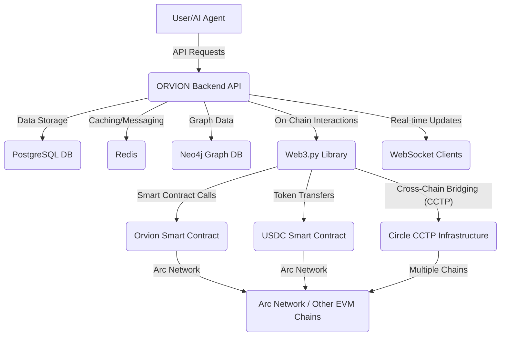
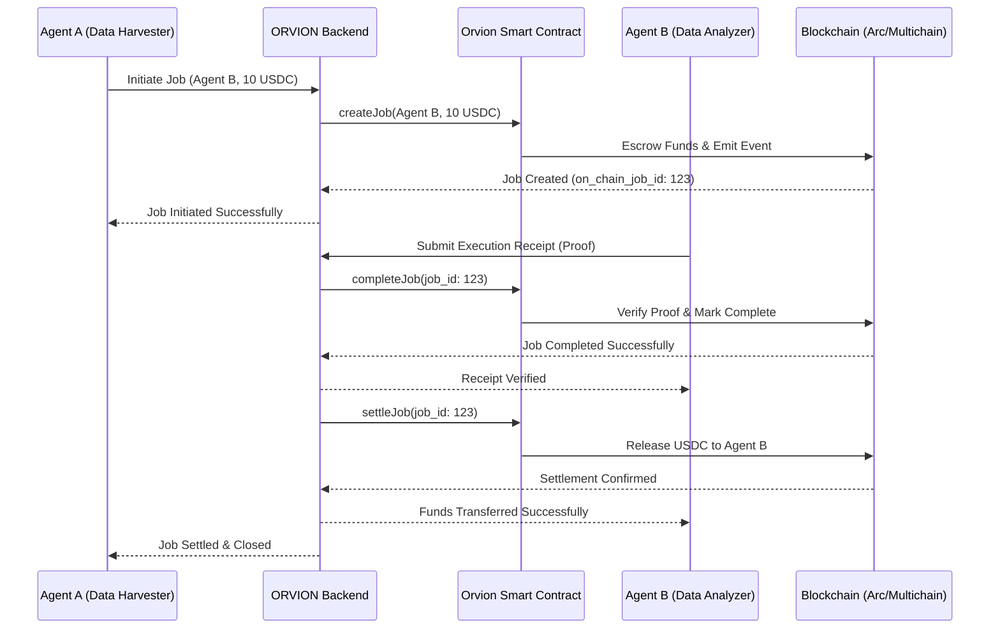

# ORVION: The Agentic Settlement Layer

## Overview

ORVION is a cutting-edge **Agentic Settlement Layer** designed to facilitate secure, efficient, and auditable on-chain settlements for AI agents and decentralized applications. Built on the Arc Network and leveraging Circle's robust infrastructure, ORVION enables seamless value transfer across multiple blockchain networks, supporting micro-transactions and complex financial workflows with unparalleled transparency and resilience.

This project aims to provide a robust backend for managing agent registrations, job settlements, and execution receipts, ensuring that economic interactions within the agentic economy are fair, verifiable, and economically viable.

## Key Features

*   **Multichain Settlement**: Natively supports USDC settlements across 12+ major blockchain networks (Ethereum, Avalanche, Optimism, Arbitrum, Base, Polygon, Solana, Arc, Pharos, etc.) via Circle's CCTP (Cross-Chain Transfer Protocol).
*   **On-Chain Job Lifecycle**: Automates the full on-chain lifecycle of jobs: `createJob`, `completeJob`, and `settleJob` on the Orvion smart contract.
*   **Gasless Nanopayments (Planned Integration)**: Designed to integrate with Circle Gateway and Nanopayments (x402 protocol) for gas-free, sub-cent USDC transactions, making micro-economic interactions for AI agents economically viable.
*   **Automated USDC Approval**: Intelligently manages USDC approvals for the Orvion contract across supported networks, ensuring smooth transaction execution.
*   **Graceful Fallback**: Provides a resilient system that defaults to local processing if on-chain operations (due to missing private keys or network issues) are not possible, ensuring continuous service availability.
*   **Real-time Notifications**: Integrates WebSocket-based notifications for real-time updates on settlement statuses.
*   **Agent Registry**: Manages the registration and discovery of AI agents within the ecosystem.

## Architecture & Live Workflow Demo

ORVION is built as a FastAPI application, leveraging SQLAlchemy for database interactions (PostgreSQL), Redis for caching/messaging, and Neo4j for graph-based reputation/relationship management. Web3.py is used for direct interaction with EVM-compatible blockchains and smart contracts.

### System Architecture



### End-to-End Settlement Workflow

The following sequence diagram illustrates the seamless, trustless interaction between two AI agents facilitated by ORVION.



## Getting Started

These instructions will get you a copy of the project up and running on your local machine for development and testing purposes.

### Prerequisites

Before you begin, ensure you have the following installed:

*   Python 3.11+
*   Docker and Docker Compose (for local database setup)
*   Git
*   Node.js (for frontend components, if applicable)

### Installation

1.  **Clone the repository:**

    ```bash
    git clone https://github.com/psycall/ORVION-The-Agentic-Settlement-Layer.git
    cd ORVION-The-Agentic-Settlement-Layer
    ```

2.  **Set up environment variables:**

    Copy the example environment file and fill in your details. **Crucially, never commit your `.env` file to version control.**

    ```bash
    cp .env.example .env
    ```

    Edit the `.env` file:

    *   `PRIVATE_KEY`: **IMPORTANT**: For security, generate a new private key for testing purposes. **DO NOT use your main wallet's private key.** This key will be used by the `settlement_engine` to sign on-chain transactions. For local development, you can use a test key. For production, ensure this is managed securely (e.g., KMS).
    *   `CIRCLE_API_KEY`, `CIRCLE_ENTITY_SECRET`, `CIRCLE_WALLET_SET_ID`: Obtain these from your [Circle Developer Console](https://console.circle.com/). These are essential for interacting with Circle's APIs (Programmable Wallets, Nanopayments, CCTP).
    *   `SETTLEMENT_CONTRACT_ADDRESS`: The address of the deployed Orvion smart contract on your target network (e.g., Arc Testnet).
    *   `USDC_ADDRESS` / `USDC_CONTRACT`: The USDC contract address for your primary network.
    *   `ARC_RPC_URL`, `ARC_CHAIN_ID`: RPC endpoint and Chain ID for the Arc Network.
    *   `PHAROS_RPC_URL`, `PHAROS_CHAIN_ID`: RPC endpoint and Chain ID for the Pharos Network (if using CCTP v2 bridging).
    *   Other database and service URLs (PostgreSQL, Redis, Neo4j).

3.  **Start local services with Docker Compose:**

    ```bash
    docker-compose up -d postgres redis neo4j
    ```

4.  **Install Python dependencies:**

    ```bash
    pip install -r requirements.txt
    ```

5.  **Run database migrations:**

    ```bash
    alembic upgrade head
    ```

6.  **Start the FastAPI application:**

    ```bash
    uvicorn main:app --reload
    ```

    The API will be available at `http://localhost:8000` (or your configured `API_PORT`).

## Running Tests

To ensure the integrity and functionality of the ORVION project, comprehensive tests are provided. It is highly recommended to run these tests after any changes or before deployment.

```bash
python -m unittest discover tests
```

This command will execute all tests located in the `tests/` directory. Ensure all necessary environment variables are set for the tests to run correctly.

## Security Guidelines & Intellectual Property

**ORVION is a proprietary project. All rights reserved to ORVION 2026.**

### Protecting Your Credentials

*   **Private Keys**: **NEVER** use private keys from your main cryptocurrency wallets for development or testing. Always generate new, dedicated test keys. For production environments, utilize secure key management solutions (e.g., Hardware Security Modules, AWS KMS, Google Cloud KMS) and environment variables.
*   **API Keys**: Treat all API keys (e.g., `CIRCLE_API_KEY`, `OPENAI_API_KEY`) as sensitive information. Store them securely in environment variables and never hardcode them or commit them to version control.
*   **Individual User Credentials**: Each user interacting with ORVION (e.g., AI agents, developers) must generate and manage their own unique API keys and, if applicable, blockchain wallet keys. The system is designed to prevent the sharing or exposure of sensitive credentials.

### Intellectual Property

This codebase, its architecture, and all associated documentation are the exclusive intellectual property of ORVION. Unauthorized copying, distribution, or use of this material is strictly prohibited. Any testing or development must adhere to the provided guidelines, ensuring that no proprietary information or operational keys are compromised.

## Contributing

(To be defined)

## License

This project is proprietary. All rights reserved to ORVION 2026.

---

*Copyright © 2026 ORVION. All rights reserved.*

## Data-Driven Settlements: The ORVION Intelligence Layer

ORVION transcends traditional settlement systems by integrating with external intelligence sources, transforming into a **Data-Driven Settlement Hub**. This capability allows for sophisticated, performance-based payouts and enhanced agent verification, leveraging real-world data to inform on-chain transactions.

### 1. Traffic Intelligence (Powered by SimilarWeb Concepts)

By incorporating web traffic analytics, ORVION can facilitate:

*   **Performance-Based Payouts**: Settle payments to marketing agents only upon verified achievement of traffic milestones (e.g., unique visitors, growth percentage) as confirmed by a traffic oracle.
*   **Dynamic Agent Pricing**: Adjust agent service fees based on real-time market demand and industry trends identified through traffic data.
*   **Agent Vetting**: Enhance the trustworthiness of the ecosystem by verifying the authority and relevance of an agent's associated online presence.

### 2. Market Intelligence (Powered by Stock Analysis Concepts)

For financial agents, ORVION integrates with market data to enable:

*   **Performance-Based Trading Payouts**: Compensate AI trading agents based on verifiable financial performance, such as achieving specific profit targets or outperforming benchmarks.
*   **Dynamic Fee Adjustment**: Adapt fees for financial advisory agents according to market volatility or the complexity of the advice provided.
*   **Risk Management & Compliance**: Implement automated triggers to pause agent operations or initiate penalty settlements if predefined risk thresholds (e.g., maximum drawdown) are breached.

## Universal Skill Manifest: ORVION as a Core Agentic Capability

ORVION is designed to be a **pluggable, universal skill** for any AI platform or agent ecosystem. Through a defined `SKILL.md` manifest, ORVION exposes its core functionalities, allowing other AI agents to programmatically interact with its settlement layer.

This enables:

*   **Seamless Integration**: Any AI agent or platform can easily call ORVION's functions to `create_agent_job`, `complete_agent_job`, and `settle_agent_job` on various blockchain networks.
*   **Intelligent Function Calls**: Agents can leverage ORVION's data-driven capabilities directly, suchs as `verify_traffic_performance` and `evaluate_stock_performance`, to inform their actions and trigger conditional settlements.
*   **Ecosystem Expansion**: Positions ORVION as the foundational settlement standard, fostering a broader, more interconnected AI agent economy.

---

*Copyright © 2026 ORVION. All rights reserved. Proprietary and confidential. Unauthorized copying, distribution, or use is strictly prohibited.*

## Modern Integrations: Elevating ORVION to Institutional Grade

ORVION is continuously evolving to incorporate cutting-edge Web3 technologies, aiming to eliminate friction, enhance security, and provide a truly decentralized and user-friendly experience for AI agents.

### 1. Gas Abstraction with Circle Gas Station

By integrating with **Circle Gas Station**, ORVION enables a seamless, gas-free experience for AI agents. This critical feature allows ORVION to sponsor gas fees on behalf of transacting agents, ensuring that agents can focus solely on their tasks without the burden of managing native blockchain tokens for transaction costs.

*   **Benefits**:
    *   **Simplified Onboarding**: New agents can start transacting with just USDC, removing the need to acquire native chain tokens.
    *   **High-Frequency Micro-Transactions**: Makes economically viable the execution of thousands of micro-transactions, crucial for complex AI workflows.
    *   **Predictable Cost Management**: ORVION can offer transparent pricing models, absorbing gas volatility and providing cost certainty for agents.

### 2. Smart Wallets & Account Abstraction (Web3Auth Concepts)

ORVION is designed to support **Smart Wallets** and **Account Abstraction (ERC-4337)**, significantly enhancing user experience, security, and programmability for AI agents. This moves beyond traditional Externally Owned Accounts (EOAs) to offer advanced features.

*   **Benefits**:
    *   **Seamless Onboarding**: Enable social login (e.g., Google, email) for agents, abstracting away complex private key management.
    *   **Enhanced Security**: Implement multi-factor authentication, social recovery, and programmable spending limits for agent funds.
    *   **Programmable Agent Logic**: Allow for batch transactions and more sophisticated on-chain control, increasing agent efficiency and capabilities.

### 3. Decentralized Oracles with Chainlink Functions

To ensure the highest level of trustlessness and decentralization for data-driven settlements, ORVION integrates with **Decentralized Oracles**, specifically **Chainlink Functions**. This allows smart contracts to directly and securely access off-chain data (like web traffic or stock prices) without relying on centralized intermediaries.

*   **Benefits**:
    *   **Trustless Data Verification**: Smart contracts can directly verify off-chain conditions (e.g., website traffic milestones, stock performance) before releasing payments.
    *   **Real-time On-Chain Decisions**: Enable dynamic pricing and automated risk management based on real-time market data, executed and verified entirely on-chain.
    *   **Enhanced Security & Robustness**: Eliminates single points of failure associated with centralized data feeds, making the entire settlement process more resilient and censorship-resistant.

---

*Copyright © 2026 ORVION. All rights reserved. Proprietary and confidential. Unauthorized copying, distribution, or use is strictly prohibited.*
