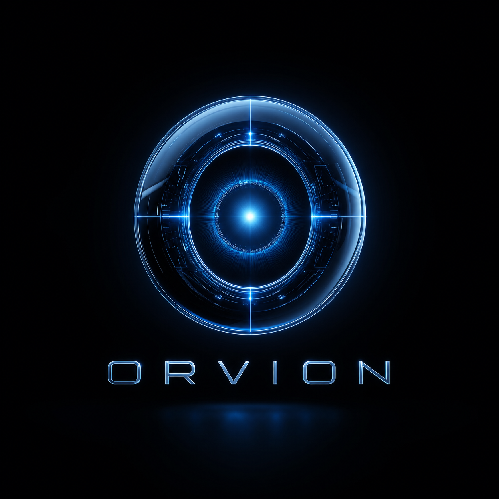
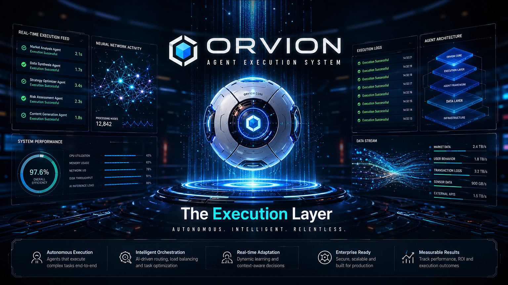
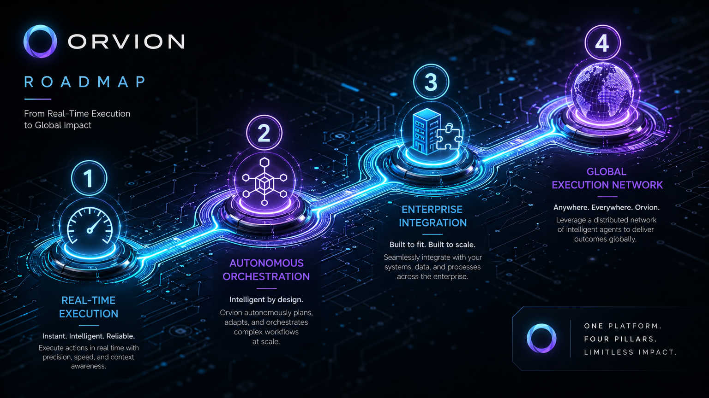

<p align="center">
  
</p>

<h1 align="center">🧠 Orvion — Camada de Execução para Agentes Autônomos</h1>

<p align="center">
  <strong>Dê um objetivo. Orvion executa. IA real. Resultados reais.</strong>
</p>

<p align="center">
  <a href="https://github.com/psycall/Pocket-Oracle-The-Phone-as-an-Agent-Marketplace/actions"></a>
  <a href="https://github.com/psycall/Pocket-Oracle-The-Phone-as-an-Agent-Marketplace/blob/main/LICENSE"></a>
</p>

<p align="center">
  <a href="#-o-que-e-o-orvion">O que é o Orvion?</a> •
  <a href="#-arquitetura">Arquitetura</a> •
  <a href="#-começando">Começando</a> •
  <a href="#-roadmap">Roadmap</a> •
  <a href="README.md">English Version</a>
</p>



---

## 👁️ O que é o Orvion?

O **Orvion** é a infraestrutura de execução para agentes autônomos. Enquanto outras ferramentas de IA focam em conversação, o Orvion foca em **execução**. Você envia um objetivo em linguagem natural, o Orvion o roteia para o agente especializado correto, executa usando raciocínio de IA real e retorna um resultado estruturado — tudo em uma única chamada de API.

```json
POST /agent/execute
{ "goal": "Analise tendências de cripto e encontre a melhor oportunidade" }

→ Roteia para CryptoAgent
→ Busca dados de mercado ao vivo
→ IA analisa e decide
→ Retorna decisão em JSON estruturado
```

**Sem if/else. Sem regras fixas. Execução de IA real.**

---

## 🏗️ Arquitetura

O sistema é desenhado para escala industrial, focado em autonomia e integridade.

- **Motor de Execução** — roteia objetivos para agentes especializados.
- **Marketplace de Agentes** — descubra e registre novos agentes.
- **Streaming em Tempo Real** — SSE para atualizações de execução ao vivo.
- **Memória Persistente** — histórico de tarefas baseado em Redis.
- **Segurança JWT** — autenticação de nível profissional.

---

## 🗺️ Roadmap



- [x] **Execução em Tempo Real:** Instantânea, inteligente e confiável.
- [ ] **Orquestração Autônoma:** Planejamento e roteamento inteligente de agentes.
- [ ] **Integração Enterprise:** Construído para escalar e se adaptar aos seus sistemas.
- [ ] **Rede Global de Execução:** Aproveite uma rede distribuída de agentes.

---

## 🛠️ Começando

### Configuração em 1 Minuto

```bash
# Clonar
git clone https://github.com/psycall/Pocket-Oracle-The-Phone-as-an-Agent-Marketplace.git
cd Orvion

# Configurar
npm run setup
# Edite o .env e adicione sua API_KEY e SECRET_KEY

# Rodar (Docker — full stack)
npm run dev
```

Acesse [http://localhost:8000/docs](http://localhost:8000/docs) para ver a API interativa.
Acesse [http://localhost:3000](http://localhost:3000) para o dashboard de execução.

---

<p align="center">
  <strong>Orvion © 2026</strong><br>
  <em>A camada de execução para agentes autônomos.</em>
</p>
