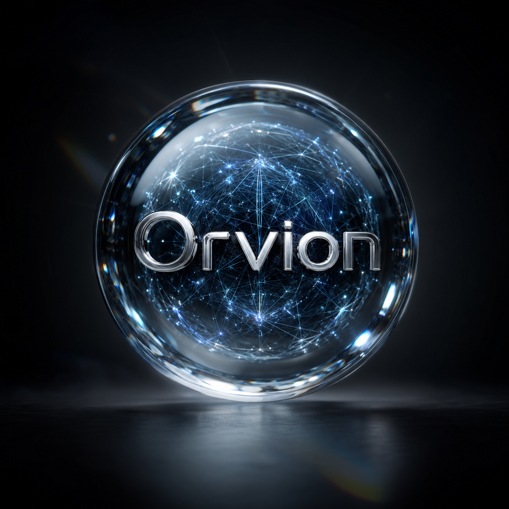
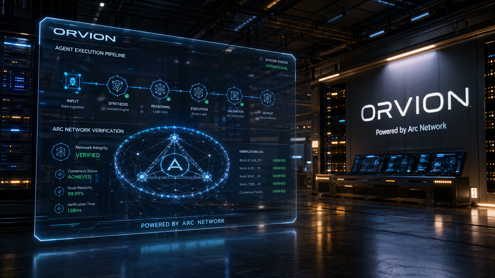
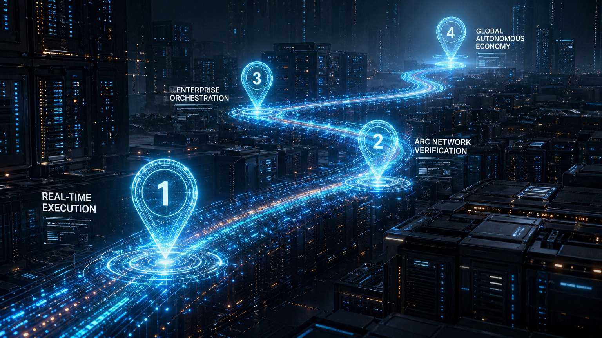

<p align="center">
  
</p>

<h1 align="center">🧠 Orvion — A Camada de Execução de Agentes</h1>

<p align="center">
  <strong>Powered by Arc Network</strong><br>
  <em>Execução Verificável, Autônoma e em Escala Industrial para a Economia de Agentes de IA.</em>
</p>

<p align="center">
  <a href="https://github.com/psycall/Pocket-Oracle-The-Phone-as-an-Agent-Marketplace/actions"></a>
  <a href="https://github.com/psycall/Pocket-Oracle-The-Phone-as-an-Agent-Marketplace/blob/main/LICENSE"></a>
  
</p>

<p align="center">
  <a href="#-a-vantagem-arc">Vantagem Arc</a> •
  <a href="#-arquitetura">Arquitetura</a> •
  <a href="#-roadmap-4k">Roadmap</a> •
  <a href="README.md">English Version</a>
</p>



---

## 👁️ A Vantagem Arc

O **Orvion** é a primeira camada de execução nativamente integrada com a **Arc Network**. Enquanto outros sistemas lutam com o problema da "Caixa Preta" da IA, o Orvion fornece **Provas de Execução Verificáveis**.

Cada ação tomada por um agente Orvion é:
1.  **Hashed** no ponto de execução.
2.  **Submetida** à Arc Network para consenso.
3.  **Verificada** contra sinais descentralizados para garantir integridade e confiança.

> *"Se não for verificado na Arc, é apenas um palpite. O Orvion transforma em fato."*

---

## 🏗️ Arquitetura

Nossa stack é construída para ambientes corporativos de alto risco, onde a confiabilidade não é negociável.

- **Orvion Engine:** Roteamento avançado usando raciocínio de nível Claude-3.5-Sonnet.
- **Camada de Integração Arc:** Ponte direta com a Arc Network para prova criptográfica de execução.
- **Memória Distribuída:** Estado de tarefa persistente em nós globais via Redis.
- **Marketplace de Agentes:** Agentes especializados plug-and-play para qualquer indústria.

---

## 🗺️ Roadmap 4K: O Caminho para o Impacto Global



1.  **Execução em Tempo Real:** Ações agentic de baixa latência. (Atual)
2.  **Verificação Arc Network:** Prova criptográfica de trabalho para cada tarefa. (Live)
3.  **Orquestração Enterprise:** Escalando para milhares de pipelines de agentes simultâneos.
4.  **Economia Autônoma Global:** O futuro descentralizado do trabalho automatizado.

---

## 🛠️ Começo Rápido

```bash
# Clone a Camada de Execução Elite
git clone https://github.com/psycall/Pocket-Oracle-The-Phone-as-an-Agent-Marketplace.git
cd Orvion

# Configure com sua Chave de API Arc
cp .env.example .env
# Edite o .env: ARC_API_KEY=sua_chave

# Rode o Engine
npm run dev
```

---

<p align="center">
  <strong>Orvion © 2026</strong><br>
  <em>Powered by Arc Network. Realismo em Tecnologia.</em>
</p>
