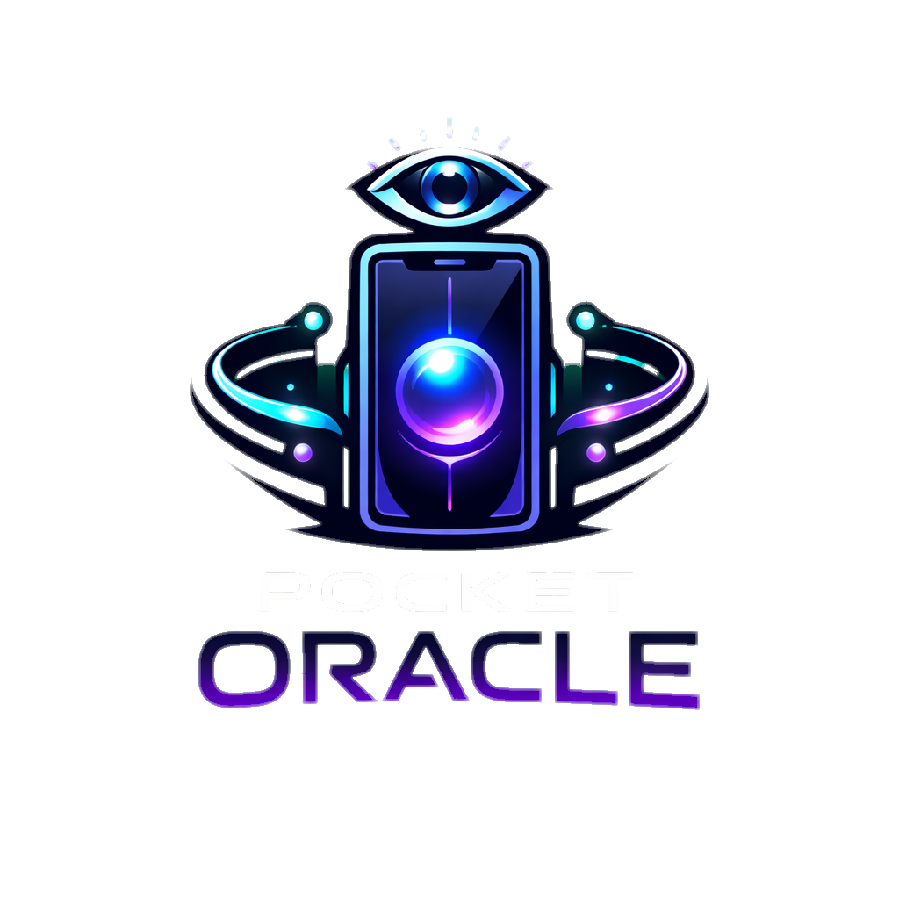
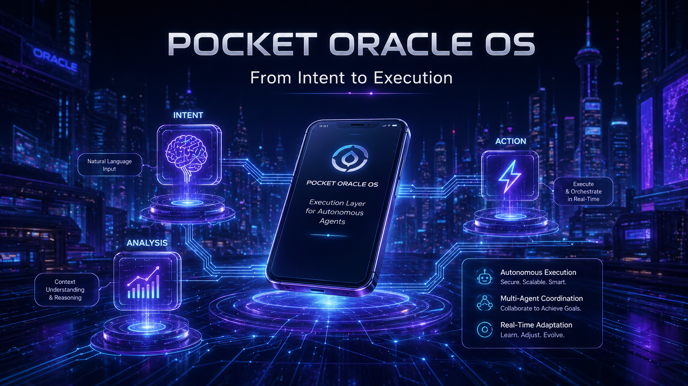
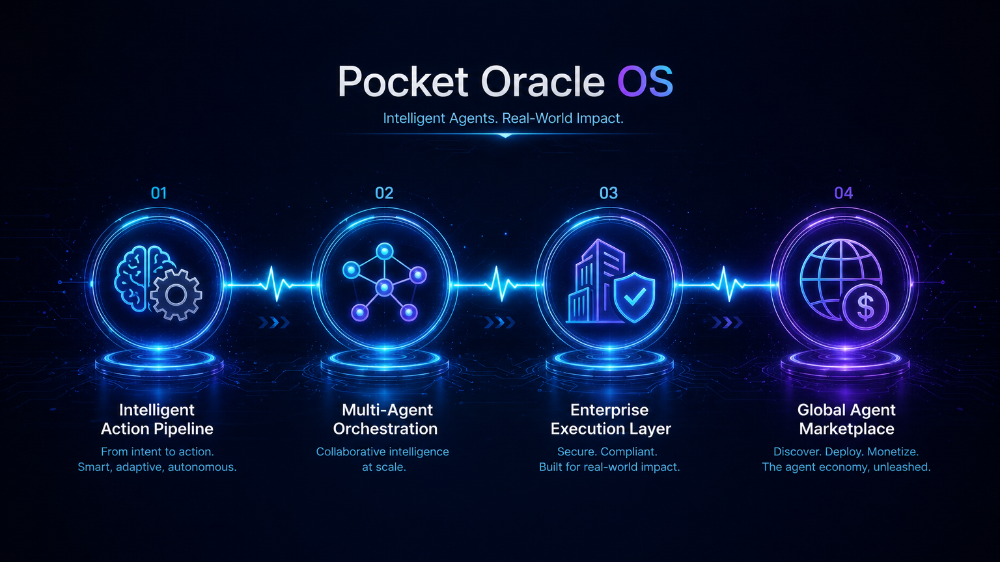

<p align="center">
  
</p>

<h1 align="center">Pocket Oracle OS</h1>

<p align="center">
  <strong>Execution Layer for Autonomous Agents</strong><br>
  <em>De intenção à execução: Transformando o smartphone na camada de ação definitiva para a economia de agentes de IA.</em>
</p>

<p align="center">
  <a href="https://github.com/psycall/Pocket-Oracle-The-Phone-as-an-Agent-Marketplace/actions"></a>
  <a href="https://github.com/psycall/Pocket-Oracle-The-Phone-as-an-Agent-Marketplace/blob/main/LICENSE"></a>
  <a href="https://github.com/psycall/Pocket-Oracle-The-Phone-as-an-Agent-Marketplace/stargazers"></a>
</p>

<p align="center">
  <a href="#-visao-executiva">Visão Executiva</a> •
  <a href="#-arquitetura-do-produto">Arquitetura</a> •
  <a href="#-funcionalidades-de-execucao">Funcionalidades</a> •
  <a href="#-roadmap-do-produto">Roadmap</a> •
  <a href="README.md">English Version</a>
</p>



---

## 👁️ Visão Executiva

O **Pocket Oracle OS** não é apenas um marketplace; é a **Execution Layer** que faltava para agentes autônomos. Enquanto outros sistemas apenas "pensam" ou "conversam", o Pocket Oracle **executa**. 

Nossa tese resolve a maior dor do mercado de IA (como ARC e outros): a fricção entre a decisão do agente e a ação no mundo real. Nós transformamos smartphones em oráculos de execução que conectam APIs, processam intenções em linguagem natural e entregam resultados concretos, sem intervenção manual.

---

## 🏗️ Arquitetura do Produto

O sistema é desenhado para escala industrial, focado em **autonomia e integridade**.

| Componente | Papel Estratégico |
| :--- | :--- |
| **Agent Engine** | O cérebro que interpreta tarefas e orquestra a execução. |
| **Orchestrator** | Encadeia múltiplos agentes para fluxos complexos de decisão. |
| **Executors** | Camada de ação real: APIs, Scraping, Transações e Sensores Mobile. |
| **User Layer** | Gestão de chaves de API, identidades e histórico de execução. |
| **Interface OS** | Mobile PWA + Dashboard Web para monitoramento em tempo real. |

---

## 🚀 Funcionalidades de Execução

Diferente de automações simples, o Pocket Oracle opera como um motor de decisão ativa.

- **Intelligent Action Pipeline:** Transformação de linguagem natural em fluxos de trabalho multi-step.
- **Real-World Oracles:** Uso de sensores de smartphones (GeoProof, SnapOCR) como prova de execução física.
- **Monetização por Execução:** Modelo de `402 Payment Required` integrado para cada tarefa concluída com sucesso.

---

## 🗺️ Roadmap do Produto (CEO Vision)

Estamos evoluindo de um protótipo técnico para uma infraestrutura de mercado global.



### Fase 1: Intelligent Action Pipeline (Atual)
- [x] Motor de execução base em FastAPI.
- [x] Integração de agentes de decisão inicial.
- [x] PWA para coleta de sinais físicos.

### Fase 2: Multi-Agent Orchestration
- [ ] Orquestração complexa entre diferentes modelos de LLM.
- [ ] Persistência de estado de execução distribuída.
- [ ] Liquidação real via micropagamentos.

### Fase 3: Enterprise Execution Layer
- [ ] SDK para integração de terceiros.
- [ ] Hardening de segurança e auditoria de jobs.
- [ ] SLAs garantidos para execução crítica.

### Fase 4: Global Agent Marketplace
- [ ] Marketplace descentralizado de executores.
- [ ] Sistema de reputação baseado em prova de trabalho (PoW).
- [ ] Escala global de oráculos físicos.

---

## 🛠️ Quick Start para Desenvolvedores

```bash
# 1. Clone o OS
git clone https://github.com/psycall/Pocket-Oracle-The-Phone-as-an-Agent-Marketplace.git
cd Pocket-Oracle-The-Phone-as-an-Agent-Marketplace

# 2. Setup de Infra
docker compose -f infra/docker/docker-compose.yml up -d

# 3. Inicie o Engine
npm install
npm run dev:api
```

---

<p align="center">
  <strong>Pocket Oracle OS © 2026</strong><br>
  <em>From Intent to Execution.</em>
</p>
