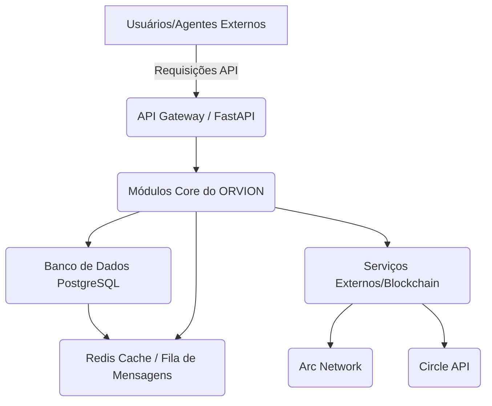
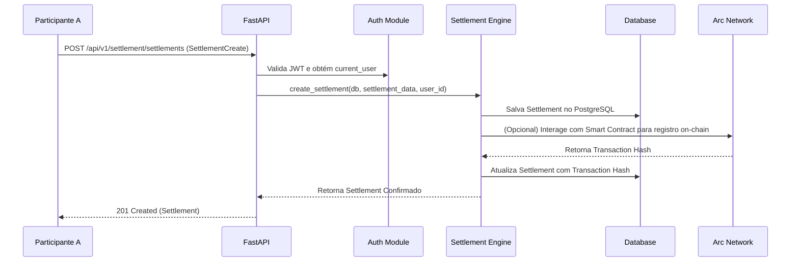

# ORVION - Arquitetura do Sistema

## 1. Visão Geral da Arquitetura

A arquitetura do ORVION foi consolidada para uma abordagem monolítica modular baseada em Python e FastAPI, visando alta performance, escalabilidade e segurança. O sistema atua como uma camada de liquidação agêntica, orquestrando agentes autônomos e facilitando transações seguras, com integração a redes blockchain como a Arc Network.

### Diagrama de Arquitetura de Alto Nível

## 2. Componentes Principais

### 2.1. API Gateway / FastAPI Backend

O coração do sistema é uma aplicação FastAPI que expõe endpoints RESTful para interação com usuários e agentes. Ele é responsável por:

- **Autenticação e Autorização**: Gerenciamento de usuários, JWTs (JSON Web Tokens) para controle de acesso.
- **Validação de Requisições**: Utiliza Pydantic para garantir a integridade e o formato dos dados de entrada.
- **Roteamento de Requisições**: Direciona as requisições para os módulos de serviço apropriados.
- **Módulos de Serviço**: Inclui lógica para gerenciamento de agentes, liquidações, histórico e estatísticas.

### 2.2. Módulos Core do ORVION

Localizados no pacote `orvion/`, esses módulos encapsulam a lógica de negócios principal:

- **`agent_registry.py`**: Gerencia o ciclo de vida dos agentes (registro, descoberta, atualização).
- **`settlement_engine.py`**: Orquestra o processo de liquidação, interagindo com o banco de dados e serviços blockchain.
- **`auth.py`**: Contém funções utilitárias para hashing de senhas, criação e verificação de JWTs.
- **`database.py`**: Configuração da conexão com o banco de dados (SQLAlchemy ORM).
- **`models.py`**: Definições dos modelos de dados (Agente, Job, Settlement, User, ExecutionReceipt).
- **`schemas.py`**: Definições dos esquemas de dados para validação e serialização (Pydantic).
- **`config.py`**: Gerencia as configurações da aplicação, carregando variáveis de ambiente.

### 2.3. Banco de Dados (PostgreSQL)

O PostgreSQL é o banco de dados relacional principal, utilizado para armazenar informações persistentes do sistema, como:

- Dados de usuários (hashed passwords, wallet addresses).
- Informações de agentes (endereços, capacidades, reputação).
- Registros de jobs e liquidações.
- Histórico de transações e recibos de execução.

### 2.4. Redis (Cache e Filas de Mensagens)

O Redis é utilizado para:

- **Caching**: Armazenamento temporário de dados frequentemente acessados para melhorar a performance.
- **Filas de Mensagens**: Pode ser empregado para processamento assíncrono de tarefas (e.g., processamento de liquidações em lote, notificações), desacoplando componentes e aumentando a resiliência.

### 2.5. Neo4j (Grafo de Relacionamentos - Opcional)

O Neo4j, um banco de dados de grafo, pode ser integrado para modelar e analisar relações complexas entre agentes, liquidações e usuários. Isso permite análises avançadas de rede, detecção de fraudes e otimização de rotas de liquidação.

### 2.6. Serviços Externos / Blockchain

- **Arc Network**: A blockchain principal para liquidação de transações. O ORVION interage com a Arc Network para registrar liquidações e verificar transações.
- **Circle API**: Utilizada para gerenciamento de stablecoins (e.g., USDC) e integração com serviços financeiros.

## 3. Fluxo de Dados (Exemplo: Criação de Liquidação)

## 4. Considerações de Escalabilidade

- **FastAPI Assíncrono**: Utiliza `async/await` para lidar com operações de I/O de forma não bloqueante, permitindo que a API processe um grande número de requisições concorrentes.
- **Banco de Dados Horizontalmente Escalável**: O PostgreSQL pode ser escalado horizontalmente com técnicas como sharding ou replicação para lidar com grandes volumes de dados e tráfego.
- **Microsserviços (Futuro)**: Embora a arquitetura atual seja monolítica modular, o design permite a futura decomposição em microsserviços para escalar componentes específicos independentemente, se necessário.
- **Filas de Mensagens**: A utilização de filas (e.g., com Redis ou RabbitMQ) para tarefas intensivas ou de longa duração garante que a API permaneça responsiva.

## 5. Melhorias Futuras

- Implementação completa da verificação de assinatura de carteira para `wallet-login`.
- Integração de um sistema de logging e monitoramento mais robusto (e.g., ELK Stack, Prometheus/Grafana).
- Adição de testes de integração e end-to-end abrangentes.
- Implementação de um sistema de cache distribuído para dados de agentes e liquidações.
- Desenvolvimento de um módulo de orquestração de agentes mais sofisticado, utilizando Neo4j para modelagem de relações complexas.

---

****
