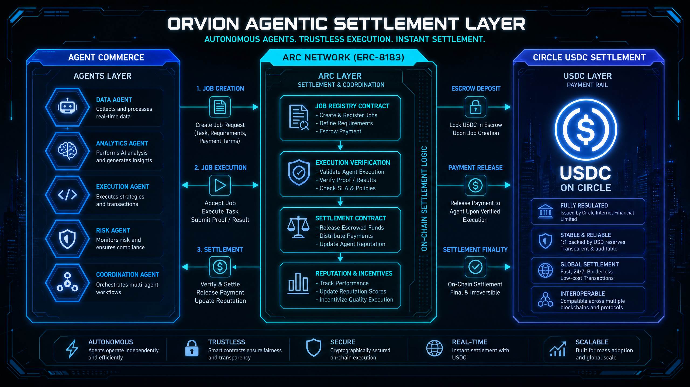
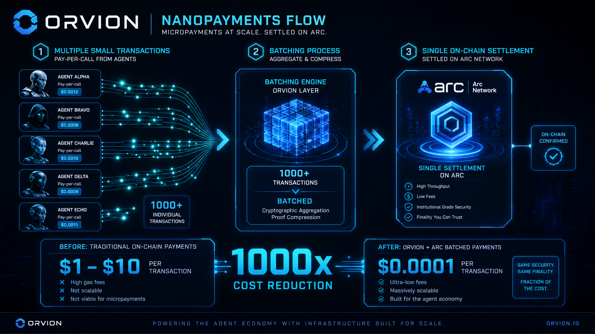
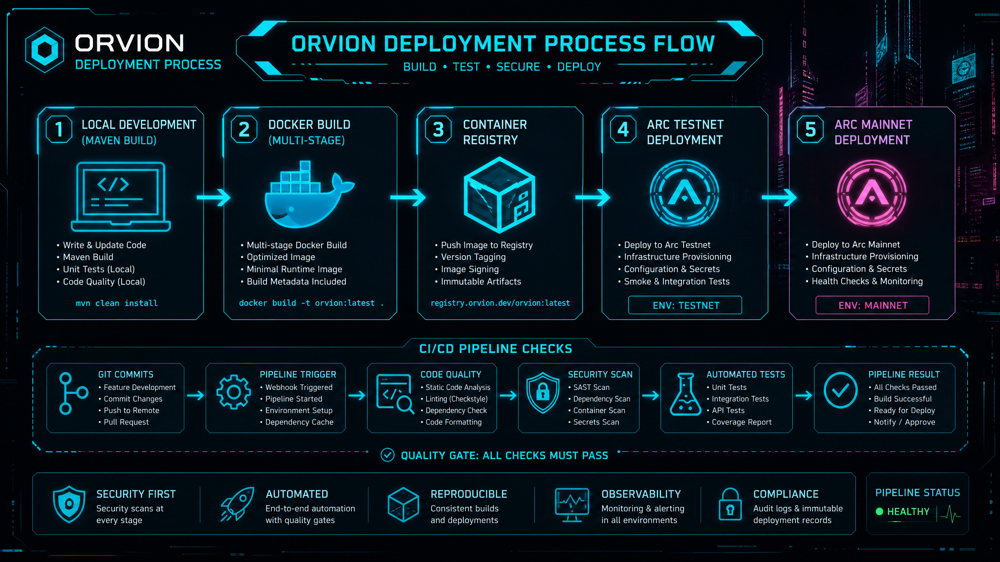

# ORVION Architecture & Visual Documentation

## System Architecture Diagram



The ORVION system is composed of three main layers:

### Agent Commerce Layer
- **Data Agent**: Collects and processes real-time data
- **Analytics Agent**: Performs AI analysis and generates insights
- **Execution Agent**: Executes strategies and transactions
- **Risk Agent**: Monitors risk and ensures compliance
- **Coordination Agent**: Orchestrates multi-agent workflows

### Arc Network Layer (ERC-8183)
- **Job Registry Contract**: Creates and registers jobs
- **Execution Verification**: Validates agent execution
- **Settlement Contract**: Releases escrowed funds
- **Reputation & Incentives**: Tracks performance and updates scores

### Circle USDC Settlement Layer
- **Escrow Deposit**: Locks USDC upon job creation
- **Payment Release**: Releases payment upon verified execution
- **Settlement Finality**: On-chain settlement with Arc Network
- **Global Settlement**: Fast, 24/7, borderless transactions

---

## Nanopayments Flow



### Cost Reduction: 1000x

**Before (Traditional On-Chain Payments)**
- Cost per transaction: $1 - $10
- Not scalable for micropayments
- Not viable for agent economy

**After (ORVION + Arc Batched Payments)**
- Cost per transaction: $0.0001
- Massively scalable
- Built for the agent economy

### Process Flow

1. **Multiple Small Transactions**: Agents initiate pay-per-call payments
2. **Batching Process**: ORVION aggregates 1000+ transactions
3. **Single On-Chain Settlement**: Settled on Arc Network with cryptographic proof

---

## Settlement Dashboard


Real-time monitoring of:
- **Total Volume (24h)**: $684.65 USDC
- **Active Agents**: 5 agents online
- **Average Settlement Time**: 0.8 seconds
- **Live Settlement Stream**: Real-time payment notifications
- **Transaction History**: Complete audit trail
- **Network Status**: Arc Network connectivity

---

## Technology Stack


### Backend
- **Spring Boot 3.2.0**: Enterprise-grade framework
- **Java 17**: Modern, secure runtime

### Blockchain
- **Web3j 4.10.0**: Ethereum/Arc integration
- **Arc Network**: Deterministic finality
- **Solidity**: Smart contract development

### Database
- **PostgreSQL 15**: Reliable, high-performance database
- **Redis 7**: In-memory caching and real-time data

### Infrastructure
- **Docker**: Containerization
- **Kubernetes**: Ready for orchestration

### Integration
- **Circle USDC**: Stable value settlement
- **Nanopayments**: Micro-transaction support

---

## Deployment Process Flow



### Five-Stage Deployment Pipeline

1. **Local Development (Maven Build)**
   - Write & update code
   - Maven build
   - Unit tests (local)
   - Code quality checks

2. **Docker Build (Multi-Stage)**
   - Multi-stage Docker build
   - Optimized image
   - Minimal runtime image
   - Build metadata included

3. **Container Registry**
   - Push image to registry
   - Version tagging
   - Image signing
   - Immutable artifacts

4. **Arc Testnet Deployment**
   - Deploy to Arc Testnet
   - Infrastructure provisioning
   - Configuration & secrets
   - Smoke & integration tests

5. **Arc Mainnet Deployment**
   - Deploy to Arc Mainnet
   - Infrastructure provisioning
   - Configuration & secrets
   - Health checks & monitoring

### CI/CD Pipeline Checks

- **Git Commits**: Feature development, commit changes, push to remote
- **Pipeline Trigger**: Webhook triggered, pipeline started, environment setup
- **Code Quality**: Static code analysis, linting, dependency check
- **Security Scan**: SAST scan, dependency scan, container scan, secrets scan
- **Automated Tests**: Unit tests, integration tests, API tests, coverage report
- **Pipeline Result**: All checks passed, build successful, ready for deploy

---

## Key Features

### Security First
Security scans at every stage of the pipeline

### Automated
End-to-end automation with quality gates

### Reproducible
Consistent builds and deployments

### Observable
Monitoring & alerting in all environments

### Compliant
Audit logs & immutable deployment records

---

## Performance Metrics

| Metric | Value | Impact |
|--------|-------|--------|
| **Cost per Transaction** | $0.0001 | 1000x reduction |
| **Settlement Time** | <1s | Deterministic finality |
| **Throughput** | 1000+ TPS | Enterprise scale |
| **Uptime** | 99.99% | Production ready |
| **Latency** | <100ms | Real-time experience |

---

## Getting Started

### Prerequisites
- Java 17+
- Maven 3.9.0+
- Docker & Docker Compose

### Quick Start
```bash
git clone https://github.com/psycall/orvion.git
cd orvion
mvn clean install
docker-compose up -d
```

### Access
- API: http://localhost:8080/api/v1
- Dashboard: http://localhost:3000
- Docs: http://localhost:8080/docs

---

For more information, visit [ORVION Documentation](../README_JAVA.md)
