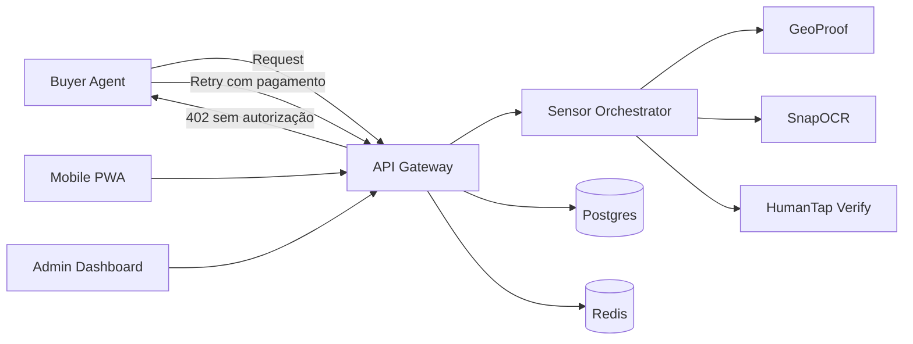

# Arquitetura

A arquitetura do Orvion foi desenhada para demonstrar, de forma executiva e técnica, como um smartphone pode operar como camada de coleta contextual para agentes de IA com monetização por requisição.

## Camadas

| Camada | Responsabilidade |
| --- | --- |
| Gateway | Validar pagamento, precificar requests e expor contratos públicos |
| Orquestrador | Executar tarefas do mundo real e padronizar resposta |
| Frontends | Demonstrar captura mobile e visibilidade operacional |
| Dados | Registrar eventos, métricas, jobs e receipts |

## Decisões de arquitetura

O gateway é a peça de monetização e reputação do sistema. O orquestrador é mantido como serviço separado para permitir futura evolução para workers assíncronos, filas, reputação por dispositivo e múltiplos provedores de execução.
